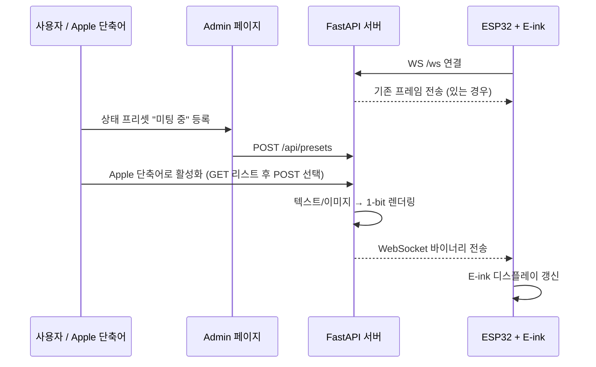

# 🖥️ E-ink Status Board

ESP32-S3 기반 **CrowPanel 3.7인치 E-paper 디스플레이**를 활용한 실시간 상태 표시 시스템.

서버에서 텍스트나 이미지를 보내면 WebSocket을 통해 전자잉크 디스플레이에 즉시 반영됩니다.
관리자 페이지에서 단축어를 등록하고, **Apple 단축어(.shortcut)**로 내보내 iPhone에서 원탭으로 제어할 수 있습니다.

```
┌──────────────┐         WebSocket (Binary)         ┌───────────────────┐
│  FastAPI 서버  │  ──────────────────────────────▶  │  ESP32-S3 + E-ink  │
│  (GCP 등)     │        12,480 bytes (1-bit)        │  CrowPanel 3.7"   │
└──────┬───────┘                                    └───────────────────┘
       │
  POST /status
  POST /api/shortcuts/{id}/activate
       │
┌──────┴───────┐
│ Admin 페이지  │
│ Apple 단축어  │
│ curl / 자동화 │
└──────────────┘
```

## 📁 프로젝트 구조

```
eink-status-board/
├── README.md                      # 프로젝트 문서
├── eink-status-board.ino          # ESP32-S3 Arduino 펌웨어
├── upload.sh                      # arduino-cli 컴파일 및 업로드 스크립트
└── server/
    ├── main.py                    # FastAPI 백엔드 서버
    ├── static/
    │   └── admin.html             # 관리자 웹 페이지
    └── data/                      # (런타임 생성)
        ├── shortcuts.json         # 단축어 데이터
        └── images/                # 업로드된 이미지 파일
```

## 🔧 기술 스택

| 구분 | 기술 |
|------|------|
| **하드웨어** | ESP32-S3, CrowPanel 3.7" E-paper (240×416) |
| **펌웨어** | Arduino (C++), WiFi.h, WebSocketsClient.h, EPaperDrive |
| **서버** | Python, FastAPI, Uvicorn, Pillow |
| **통신** | WebSocket (바이너리 프레임) |
| **관리자** | 웹 기반 Admin 대시보드 |
| **iOS 연동** | Apple Shortcuts (.shortcut) 내보내기 |

## ⚙️ 설정

### 서버 (server/main.py)

서버 파일 상단의 상수를 환경에 맞게 수정합니다:

```python
# 폰트 경로 — 서버 OS에 맞는 한글 폰트 경로 지정
FONT_PATH = "/System/Library/Fonts/AppleSDGothicNeo.ttc"   # macOS
# FONT_PATH = "/usr/share/fonts/truetype/noto/NotoSansCJK-Regular.ttc"  # Linux

# 폰트 크기
FONT_SIZE = 36
```

### 펌웨어 (eink-status-board.ino)

`.ino` 파일 상단의 Wi-Fi 및 서버 정보를 수정합니다:

```cpp
const char* WIFI_SSID     = "YOUR_WIFI_SSID";
const char* WIFI_PASSWORD = "YOUR_WIFI_PASSWORD";
const char* WS_HOST       = "SERVER_IP";    // 서버 공인 IP 또는 도메인
const uint16_t WS_PORT    = 5000;
```

## ☁️ GCP 무과금 백엔드 구축 가이드 (Smart Nameplate)

이 문서는 GCP(Google Cloud Platform) e2-micro 무료 티어 인스턴스에서 e-ink 표찰용 FastAPI 서버를 구축하기 위한 인프라 설정 가이드입니다.

### 1. 인프라 요구사항 (GCP Always Free)
- **Region**: us-central1, us-west1, us-east1 중 선택
- **Machine Type**: e2-micro
- **Boot Disk**: 🚨 반드시 **'Standard Persistent Disk'** 선택 (30GB 이하)
- **Firewall**: TCP 5000 포트 개방 필요

### 2. 초기 시스템 환경 설정
서버에 접속한 후 가장 먼저 실행해야 할 명령어들입니다.

```bash
# 시스템 업데이트 및 필수 패키지(cron, git, curl 등) 설치
sudo apt update && sudo apt install cron git curl -y

# cron 서비스 활성화
sudo systemctl start cron
sudo systemctl enable cron
```

### 3. Python 환경 구축 (uv 활용)
빠르고 효율적인 패키지 관리를 위해 `uv`를 사용합니다.

```bash
# 1. uv 설치 및 환경변수 적용
curl -LsSf https://astral.sh/uv/install.sh | sh
source $HOME/.local/bin/env  # 또는 source ~/.bashrc

# 2. 프로젝트 소스코드 다운로드 (Git Clone)
git clone https://github.com/[본인_깃허브_계정]/eink-status-board.git ~/nameplate
cd ~/nameplate/server

# 3. 가상환경 생성 및 라이브러리 설치
uv venv
source .venv/bin/activate
uv pip install -r requirements.txt
```

### 4. DuckDNS (DDNS) 자동 업데이트 설정
서버 재부팅 시 IP가 바뀌어도 도메인을 유지하기 위한 설정입니다.

```bash
# 1. duckdns 폴더 생성
mkdir ~/duckdns && cd ~/duckdns

# 2. 업데이트 스크립트 생성 (Direct 주입)
# [나의도메인]과 [나의토큰]을 실제 값으로 수정하여 실행
cat << 'EOF' > ~/duckdns/duck.sh
echo url="https://www.duckdns.org/update?domains=[나의도메인]&token=[나의토큰]&ip=" | curl -k -o ~/duckdns/duck.log -K -
EOF

# 3. 권한 부여
chmod 700 ~/duckdns/duck.sh

# 4. 크론탭(Crontab) 스케줄 등록 (5분 주기 + 부팅 시 즉시 실행)
(crontab -l 2>/dev/null; echo "*/5 * * * * ~/duckdns/duck.sh >/dev/null 2>&1") | crontab -
(crontab -l 2>/dev/null; echo "@reboot ~/duckdns/duck.sh >/dev/null 2>&1") | crontab -
```

### 5. 서버 실행 가이드 (GCP 환경)

```bash
cd ~/nameplate/server
source .venv/bin/activate

# 백그라운드 실행을 원할 경우 nohup 사용
# uvicorn main:app --host 0.0.0.0 --port 5000
nohup uvicorn main:app --host 0.0.0.0 --port 5000 > server.log 2>&1 &
```

## 🚀 실행 방법

### 1. 서버 실행

```bash
# 의존성 설치
pip install fastapi uvicorn pillow python-multipart python-dotenv

# 서버 시작 (0.0.0.0:5000)
cd server
python main.py
```

또는 직접 Uvicorn으로 실행:

```bash
uvicorn main:app --host 0.0.0.0 --port 5000
```

### 2. 관리자 페이지 접속

브라우저에서 `http://localhost:5000/admin` 접속

### 3. 펌웨어 업로드

```bash
# arduino-cli로 컴파일 및 업로드
bash upload.sh
```

> **사전 준비**: ESP32 보드 패키지, WebSockets 라이브러리, 그리고 **Elecrow EPaperDrive 라이브러리**가 설치되어 있어야 합니다.
>
> ```bash
> # ESP32 보드 및 WebSockets 라이브러리
> arduino-cli core install esp32:esp32
> arduino-cli lib install WebSockets
> ```
>
> **EPaperDrive 라이브러리 설치** (수동):
> 1. [Elecrow 공식 Examples ZIP](https://www.elecrow.com/download/product/CrowPanel/E-paper/3.7-DIE01237S/Arduino/Examples.zip) 또는 [GitHub 저장소](https://github.com/Elecrow-RD/CrowPanel-ESP32-3.7-E-paper-HMI-Display-with-240-416/tree/master/example/arduino/libraries)에서 `EPaperDrive-main` 폴더를 다운로드합니다.
> 2. 해당 폴더를 Arduino 라이브러리 경로에 복사합니다:
>    - **macOS**: `~/Documents/Arduino/libraries/`
>    - **Windows**: `C:\Users\<사용자>\Documents\Arduino\libraries\`
>
> **Arduino IDE 보드 설정**:
> - Board: `ESP32S3 Dev Module`
> - PSRAM: `OPI PSRAM`
> - Partition Scheme: `Huge APP (3MB No OTA/1MB SPIFFS)`

## 📡 API 레퍼런스

### 상태 API

| Method | Endpoint | 설명 |
|--------|----------|------|
| `POST` | `/status` | 텍스트 상태 업데이트 및 디스플레이 푸시 |
| `GET` | `/status` | 현재 상태 텍스트 및 연결 정보 조회 |
| `GET` | `/current-preview.png` | 현재 디스플레이 화면 미리보기 (PNG) |
| `WS` | `/ws` | ESP32 WebSocket 연결 엔드포인트 |

### 단축어 API

| Method | Endpoint | 설명 |
|--------|----------|------|
| `GET` | `/api/presets` | 등록된 프리셋 목록 조회 |
| `POST` | `/api/presets` | 새 프리셋 생성 (이미지) |
| `DELETE` | `/api/presets/{id}` | 프리셋 삭제 |
| `POST` | `/api/presets/{id}/activate` | 프리셋 활성화 (디스플레이 푸시) |
| `GET` | `/api/presets/{id}/preview.png` | 프리셋 미리보기 이미지 (PNG) |

### 사용 예시

```bash
# 텍스트 상태 업데이트
curl -X POST http://localhost:5000/status \
  -H "Content-Type: application/json" \
  -d '{"text": "미팅 중 🧑‍💻"}'

# 프리셋 활성화
curl -X POST http://localhost:5000/api/presets/{id}/activate
```

## 🍎 Apple 단축어 연동 (마스터 단축어 방식)

다운로드 방식의 단축어 설치는 최신 iOS/macOS 보안 정책상 불가능합니다.
대신, 서버 API와 연동되는 **마스터 단축어 딱 1개**만 기기(단축어 앱)에 생성해 두면 평생 사용할 수 있습니다.

### 설정 방법 (1분 소요)
1. 단축어 앱에서 새 단축어를 만듭니다. (이름: "E-ink 갱신" 등)
2. **URL** 동작을 추가하고 서버 주소(`http://서버IP:5000/api/presets`)를 넣습니다.
3. **URL의 콘텐츠 가져오기** 동작을 추가합니다.
4. **목록에서 선택** 동작을 추가합니다.
5. **사전 값 가져오기** 동작을 추가해 선택한 항목에서 `id`를 가져옵니다.
6. **URL** 동작을 추가하고, 주소를 `http://서버IP:5000/api/presets/[사전 값]/activate` 형태로 만듭니다.
7. **URL의 콘텐츠 가져오기** 동작을 마지막으로 추가하고, **POST** 방식으로 변경합니다.

이제 이 단축어를 제어 센터나 메뉴 막대, 위젯 등에 등록해두면 잉크 디스플레이 화면을 한 번 클릭으로 간편하게 바꿀 수 있습니다! 프리셋이 추가될 때마다 단축어 목록도 알아서 갱신됩니다.

## 🔄 동작 흐름



## 📐 디스플레이 스펙

| 항목 | 값 |
|------|----|
| 패널 | CrowPanel 3.7" E-paper |
| 드라이버 IC | UC8253 |
| 방향 | 가로 모드 (Landscape) |
| 해상도 | 416 × 240 px |
| 색상 | 흑백 (1-bit) |
| 프레임 크기 | 12,480 bytes (416 × 240 ÷ 8) |
| 전원 핀 | GPIO 7 (HIGH = ON) |
| 통신 | 4-wire SPI |

## 📝 참고 사항

- **E-ink 수명 보호**: 상태가 변경될 때만 화면을 갱신합니다. 주기적 새로고침 로직은 의도적으로 포함하지 않았습니다.
- **자동 재연결**: ESP32 펌웨어에 5초 간격 자동 재연결 및 하트비트(15초 ping)가 설정되어 있습니다.
- **디스플레이 드라이버**: Elecrow `EPaperDrive` 라이브러리(UC8253)를 사용합니다. `EPD_FastInit() → EPD_Display() → EPD_Update() → EPD_DeepSleep()` 흐름으로 화면을 갱신합니다.
- **GxEPD2와의 차이**: CrowPanel 3.7"은 GxEPD2의 `GxEPD2_370` (Waveshare 280×480)과 **호환되지 않습니다**. 반드시 Elecrow 공식 EPaperDrive 라이브러리를 사용하세요.
- **이미지 리사이즈**: 업로드된 이미지가 416×240이 아닐 경우, 비율을 유지하며 흰색 여백(레터박스)을 추가하여 자동 변환됩니다.
- **python-multipart**: 이미지 업로드를 위해 `python-multipart` 패키지가 필요합니다.
