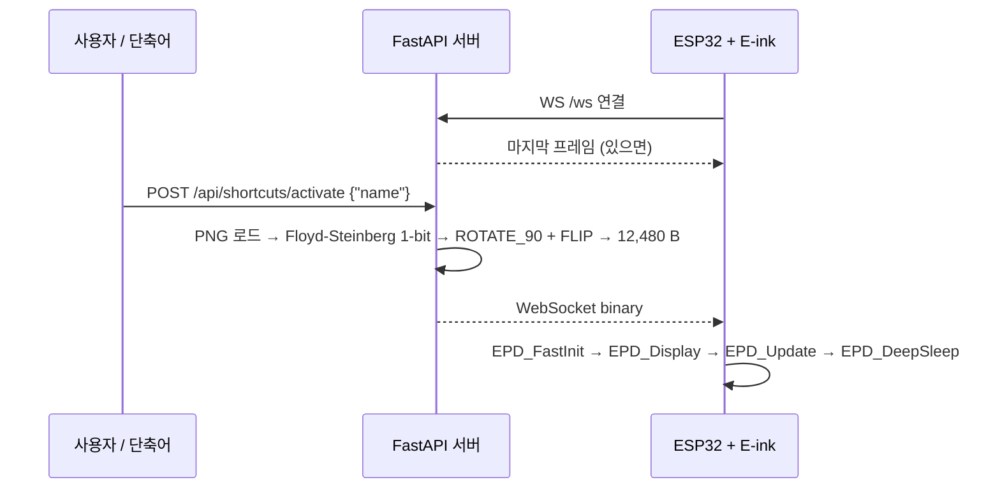

# 🖥️ E-ink Status Board

ESP32-S3 + **CrowPanel 3.7" E-paper** 로 만드는 실시간 상태 표시판.
Admin 페이지에 "회의 중", "자리 비움" 같은 상태 이미지를 등록해 두고,
iPhone 단축어·브라우저·curl 어디서든 한 번에 전자잉크 화면을 바꿉니다.

```
 Admin 페이지 / Apple 단축어 / curl
              │  POST /api/presets/{id}/activate
              │  POST /api/shortcuts/activate  {"name": "..."}
              ▼
┌──────────────────────────┐   WebSocket (binary, 12,480 B)   ┌──────────────────────┐
│  FastAPI 서버 (server/)  │ ───────────────────────────────▶ │  ESP32-S3 + E-paper  │
│  Pillow: RGB → 1-bit     │                                  │  416×240, 1-bit BW   │
└──────────────────────────┘                                  └──────────────────────┘
```

## 목차

- [구성 요소](#구성-요소)
- [빠른 시작](#빠른-시작)
- [설정](#설정)
- [API 레퍼런스](#api-레퍼런스)
- [동작 원리](#동작-원리)
- [문서](#문서)
- [참고 사항](#참고-사항)

## 구성 요소

```
eink-status-board/
├── eink-status-board.ino.sample   # ESP32 펌웨어 템플릿 (복사해서 .ino 로 사용)
├── src/                           # Elecrow EPaperDrive 드라이버 (UC8253)
├── upload.sh                      # arduino-cli 컴파일 + 업로드
├── server/
│   ├── main.py                    # FastAPI 서버 (API + WebSocket + 이미지 파이프라인)
│   ├── requirements.txt
│   ├── static/admin.html          # 관리자 페이지 (단일 HTML, 프레임워크 없음)
│   └── data/                      # 런타임 데이터 (git 제외)
│       ├── presets.json           #   프리셋 메타데이터
│       └── images/{id}.png        #   416×240 으로 정규화된 원본
└── docs/
    ├── deploy-gcp.md              # GCP 무료 티어 + DuckDNS + systemd 배포
    └── apple-shortcuts.md         # iPhone 단축어 연동
```

| 구분 | 기술 |
|------|------|
| 하드웨어 | ESP32-S3, CrowPanel 3.7" E-paper (UC8253, 416×240, 1-bit) |
| 펌웨어 | Arduino C++, WiFi, WebSocketsClient (Markus Sattler), Elecrow EPaperDrive |
| 서버 | Python 3.10+, FastAPI, Uvicorn, Pillow |
| 관리자 | Vanilla HTML/JS |
| iOS | Apple 단축어 (마스터 단축어 1개) |

## 빠른 시작

### 1. 서버

```bash
cd server
python -m venv .venv && source .venv/bin/activate
pip install -r requirements.txt
python main.py                    # http://0.0.0.0:5000
```

브라우저에서 `http://localhost:5000/admin` 을 열고 이미지를 올려 프리셋을 만듭니다.
업로드한 이미지는 비율을 유지한 채 416×240 으로 레터박스 처리되고, 미리보기는 실제 E-ink에 표시될 1-bit 디더링 결과를 보여줍니다.

### 2. 펌웨어

```bash
# 사전 준비 (최초 1회)
arduino-cli core install esp32:esp32
arduino-cli lib install WebSockets
# Elecrow EPaperDrive 는 아래 링크에서 수동 설치 → ~/Documents/Arduino/libraries/
#   https://github.com/Elecrow-RD/CrowPanel-ESP32-3.7-E-paper-HMI-Display-with-240-416/tree/master/example/arduino/libraries

cp eink-status-board.ino.sample eink-status-board.ino
# .ino 상단의 WIFI_SSID / WIFI_PASSWORD / WS_HOST 수정
bash upload.sh                    # 시리얼 포트가 다르면 PORT=/dev/cu.xxx bash upload.sh
```

`eink-status-board.ino` 는 Wi-Fi 비밀번호를 담고 있어 `.gitignore` 에 등록되어 있습니다. 코드 수정은 `.ino.sample` 에도 똑같이 반영해 주세요.

Arduino IDE를 쓴다면: Board `ESP32S3 Dev Module`, PSRAM `OPI PSRAM`, Partition `Huge APP (3MB No OTA/1MB SPIFFS)`.

### 3. 확인

ESP32 시리얼 모니터(115200)에 `[WebSocket] ✅ 연결 성공!` 이 뜨고 Admin 상단이 "1개 디바이스 연결" 로 바뀌면 끝입니다.
프리셋의 **▶ 적용** 을 누르면 몇 초 안에 화면이 바뀝니다.

## 설정

### 서버 환경변수 (`server/.env` 또는 시스템 환경변수)

| 변수 | 기본값 | 설명 |
|------|--------|------|
| `SERVER_HOST` | `0.0.0.0` | 바인딩 주소. 리버스 프록시 뒤에서는 `127.0.0.1` |
| `SERVER_PORT` | `5000` | HTTP/WebSocket 포트 |
| `SERVER_RELOAD` | `false` | 코드 변경 시 자동 재시작 (개발용). 운영에서는 끄세요 |

### 펌웨어 상수 (`eink-status-board.ino` 상단)

```cpp
const char* WIFI_SSID     = "YOUR_WIFI_SSID";
const char* WIFI_PASSWORD = "YOUR_WIFI_PASSWORD";
const char* WS_HOST       = "SERVER_IP";   // 서버 IP 또는 도메인
const uint16_t WS_PORT    = 5000;
```

## API 레퍼런스

인증은 없습니다. 인터넷에 노출한다면 [배포 가이드의 보안 절](docs/deploy-gcp.md#6-보안-강화-권장)을 먼저 적용하세요.

### 프리셋

| Method | Endpoint | 설명 |
|--------|----------|------|
| `GET` | `/api/presets` | 프리셋 목록 |
| `POST` | `/api/presets` | 생성. `multipart/form-data` — `name`(≤100자, 줄바꿈 불가, 중복 시 `409`), `image`(≤5MB, ≤24MP). 성공 시 `201`, 최대 200개 |
| `DELETE` | `/api/presets/{id}` | 삭제 (이미지 파일 포함) |
| `POST` | `/api/presets/{id}/activate` | 활성화 — 연결된 모든 디스플레이에 푸시. 응답에 `clients_notified` |
| `GET` | `/api/presets/{id}/preview.png` | E-ink에 표시될 1-bit 미리보기 (하루 캐시) |

### Apple 단축어용

| Method | Endpoint | 설명 |
|--------|----------|------|
| `GET` | `/api/shortcuts/names` | 프리셋 이름 목록, 줄바꿈 구분 **plain text** |
| `POST` | `/api/shortcuts/activate` | `{"name": "..."}` 으로 활성화. 없으면 `404` |

### 상태·디바이스

| Method | Endpoint | 설명 |
|--------|----------|------|
| `GET` | `/status` | 현재 프리셋 이름, 연결된 디바이스 수, 프레임 준비 여부 |
| `GET` | `/current-preview.png` | 현재 화면 미리보기 (캐시 안 함) |
| `WS` | `/ws` | ESP32 연결. 접속 직후 마지막 프레임을 바로 보내 화면을 복원 |
| `GET` | `/admin` | 관리자 페이지 (`/` 는 여기로 리다이렉트) |

### 예시

```bash
# 프리셋 생성
curl -F "name=회의 중" -F "image=@meeting.png" http://localhost:5000/api/presets

# 이름으로 활성화 (단축어와 동일)
curl -X POST http://localhost:5000/api/shortcuts/activate \
  -H "Content-Type: application/json" -d '{"name": "회의 중"}'
```

## 동작 원리


```mermaid
sequenceDiagram
    participant U as 사용자 / 단축어
    participant S as FastAPI 서버
    participant E as ESP32 + E-ink

    E->>S: WS /ws 연결
    S-->>E: 마지막 프레임 (있으면)
    U->>S: POST /api/shortcuts/activate {"name"}
    S->>S: PNG 로드 → Floyd-Steinberg 1-bit → ROTATE_90 + FLIP → 12,480 B
    S-->>E: WebSocket binary
    E->>E: EPD_FastInit → EPD_Display → EPD_Update → EPD_DeepSleep
```

**이미지 파이프라인의 두 가지 필수 조건**

1. **디더링** — `img.convert("1")` 의 Floyd-Steinberg 디더링을 씁니다. 단순 임계값 변환은 노란 이모지처럼 밝은 색을 통째로 날려버립니다.
2. **회전 + 좌우 반전** — 서버는 416×240 가로, 펌웨어는 240×416 세로 좌표계를 씁니다. UC8253 메모리 스캔 방향 때문에 `ROTATE_90` 뒤 `FLIP_LEFT_RIGHT` 를 해야 하며, 순서를 바꾸면 화면이 뒤집힙니다.

| 디스플레이 스펙 | 값 |
|------|----|
| 패널 / 드라이버 | CrowPanel 3.7" / UC8253 |
| 해상도 | 416 × 240 (서버 기준 가로) |
| 프레임 | 12,480 bytes = 416 × 240 ÷ 8, MSB 첫 픽셀, 1 = 흰색 |
| 전원 핀 | GPIO 7 (HIGH = ON) |
| 통신 | 4-wire SPI |

## 문서

- [GCP 무료 티어 배포 가이드](docs/deploy-gcp.md) — e2-micro, DuckDNS, systemd, 보안 강화
- [Apple 단축어 연동](docs/apple-shortcuts.md) — 마스터 단축어 만들기, 문제 해결

## 참고 사항

- **E-ink 수명**: 상태가 바뀔 때만 갱신합니다. 주기적 새로고침은 의도적으로 넣지 않았습니다.
- **재연결**: 펌웨어는 5초 간격 자동 재연결과 15초 heartbeat ping을 사용합니다. 서버를 재시작해도 ESP32가 알아서 다시 붙고 마지막 화면을 복원합니다.
- **GxEPD2 비호환**: CrowPanel 3.7" 은 GxEPD2의 `GxEPD2_370` 과 호환되지 않습니다. 반드시 Elecrow EPaperDrive 를 쓰세요.
- **데이터 백업**: `server/data/` 만 복사하면 프리셋 전체가 복원됩니다.
