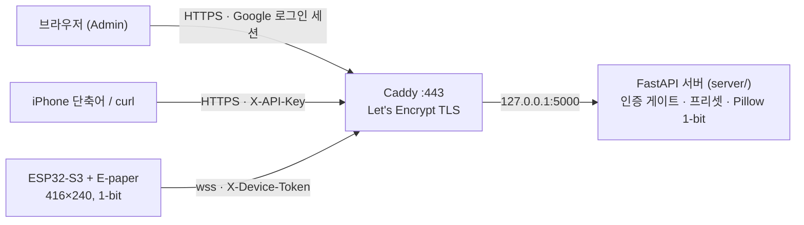
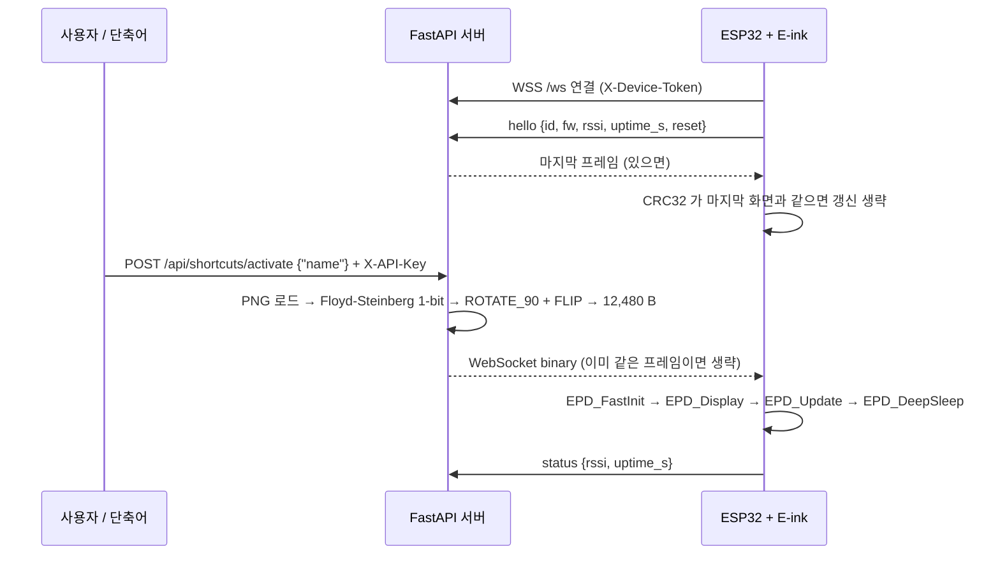

# 🖥️ E-ink Status Board

ESP32-S3 + **CrowPanel 3.7" E-paper** 로 만드는 실시간 상태 표시판.
Admin 페이지에 "회의 중", "자리 비움" 같은 상태를 이미지나 텍스트로 등록해 두고,
iPhone 단축어·브라우저·curl 어디서든 한 번에 전자잉크 화면을 바꿉니다.
서버는 HTTPS 로 공개되고, 브라우저는 Google 로그인, 단축어는 API 키, ESP32 는 디바이스 토큰으로 인증합니다.


```mermaid
flowchart LR
    B["브라우저 (Admin)"] -- "HTTPS · Google 로그인 세션" --> C
    S["iPhone 단축어 / curl"] -- "HTTPS · X-API-Key" --> C
    E["ESP32-S3 + E-paper<br/>416×240, 1-bit"] -- "wss · X-Device-Token" --> C
    C["Caddy :443<br/>Let's Encrypt TLS"] -- "127.0.0.1:5000" --> F["FastAPI 서버 (server/)<br/>인증 게이트 · 프리셋 · Pillow 1-bit"]
```

프레임(12,480 B)은 ESP32 가 먼저 맺어 둔 WebSocket 연결을 통해 서버에서 ESP32 로 푸시됩니다.

| 클라이언트 | 접속 | 인증 | 쓸 수 있는 범위 |
|-----------|------|------|-----------------|
| 브라우저 (Admin) | `https://<도메인>/admin` | Google 로그인 → 세션 쿠키. `ALLOWED_EMAILS` 에 있는 계정만 | 전체 API |
| 단축어 / curl | `https://<도메인>/api/shortcuts/*` | `X-API-Key` 헤더 (`API_KEY`) | 이름 목록 조회, 이름으로 활성화 |
| ESP32 | `wss://<도메인>/ws` | `X-Device-Token` 헤더 (`DEVICE_TOKEN`) | WebSocket 연결 하나 |

## 목차

- [구성 요소](#구성-요소)
- [빠른 시작](#빠른-시작)
- [설정](#설정)
- [API 레퍼런스](#api-레퍼런스)
- [WebSocket 프로토콜](#websocket-프로토콜)
- [동작 원리](#동작-원리)
- [문서](#문서)
- [참고 사항](#참고-사항)

## 구성 요소

```
eink-status-board/
├── eink-status-board.ino.sample   # ESP32 펌웨어 템플릿 (복사해서 .ino 로 사용)
├── src/                           # Elecrow EPaperDrive 드라이버 (UC8253)
├── upload.sh                      # arduino-cli 컴파일 + 업로드
├── tools/ctags-shim/ctags         # Rosetta 없는 Apple Silicon 용 ctags 대용품 (upload.sh 가 필요할 때만 사용)
├── server/
│   ├── main.py                    # FastAPI 서버 (인증 + API + WebSocket + 이미지 파이프라인)
│   ├── requirements.txt
│   ├── .env                       # 환경변수·비밀 값 (git 제외, 직접 생성)
│   ├── static/admin.html          # 관리자 페이지 (단일 HTML, 프레임워크 없음)
│   └── data/                      # 런타임 데이터 (images/.gitkeep 만 추적, 나머지는 git 제외)
│       ├── presets.json           #   프리셋 메타데이터 (배열 순서 = 표시 순서)
│       ├── state.json             #   마지막 활성 프리셋 + 세션 세대 값 + 디바이스 접속 이력
│       └── images/{id}.png        #   416×240 으로 정규화된 이미지 (텍스트 프리셋 포함)
└── docs/
    ├── deploy-gcp.md              # GCP 무료 티어 + DuckDNS + Caddy(HTTPS) + systemd 배포
    ├── google-oauth.md            # Google OAuth 클라이언트 만들기
    └── apple-shortcuts.md         # iPhone 단축어 연동
```

| 구분 | 기술 |
|------|------|
| 하드웨어 | ESP32-S3, CrowPanel 3.7" E-paper (UC8253, 416×240, 1-bit) |
| 펌웨어 | Arduino C++, WiFi, WebSocketsClient (Markus Sattler), Elecrow EPaperDrive |
| 서버 | Python 3.10+, FastAPI, Uvicorn, Pillow, Authlib |
| 인증 | Google OAuth(OpenID Connect) 세션, API 키, 디바이스 토큰 |
| 프록시 | Caddy (자동 HTTPS) |
| 관리자 | Vanilla HTML/JS |
| iOS | Apple 단축어 (마스터 단축어 1개) |

## 빠른 시작

### 1. 서버 (로컬 개발)

```bash
cd server
python -m venv .venv && source .venv/bin/activate
pip install -r requirements.txt
AUTH_DISABLED=true python main.py          # http://0.0.0.0:5000 — 인증 없음, 개발 전용
```

브라우저에서 `http://localhost:5000/admin` 을 열고 이미지나 텍스트로 프리셋을 만듭니다.
업로드한 이미지는 비율을 유지한 채 416×240 으로 레터박스 처리되고, 미리보기는 실제 E-ink에 표시될 1-bit 디더링 결과를 보여줍니다.

- **왜 `AUTH_DISABLED=true` 가 필요한가**: 서버는 인증 설정이 불완전하면 시작하지 않습니다(fail closed). 설정을 깜빡하고 모든 API 가 열린 채 뜨는 사고를 막기 위해서입니다.
  `AUTH_DISABLED=true` 없이 OAuth 변수를 비워 두면 `인증 설정 누락: ...` 오류로 종료됩니다.
- `AUTH_DISABLED=true` 에서는 **모든 API 와 `/ws` 가 무인증**입니다. 같은 네트워크의 누구나 화면을 바꿀 수 있으니, ESP32 를 LAN 에서 붙일 때가 아니면 `SERVER_HOST=127.0.0.1` 을 함께 쓰세요.
- 운영 `.env` 에 `AUTH_DISABLED` 가 실수로 남는 사고를 막기 위해, `PUBLIC_BASE_URL=https://...` 와 함께 쓰면 서버가 시작을 거부합니다.
- 로그인 흐름까지 로컬에서 시험하려면 [google-oauth.md](docs/google-oauth.md#8-로컬에서-로그인-테스트-선택).
- 텍스트 프리셋에는 한글 폰트가 필요합니다. macOS 는 기본 폰트를 자동으로 찾고, Ubuntu 는 `sudo apt install -y fonts-nanum`.
- 코드를 고치며 개발할 때는 `SERVER_RELOAD=true AUTH_DISABLED=true python main.py`.

### 2. 펌웨어

```bash
# 사전 준비 (최초 1회)
arduino-cli core install esp32:esp32
arduino-cli lib install WebSockets
# Elecrow EPaperDrive 는 아래 링크에서 수동 설치 → ~/Documents/Arduino/libraries/
#   https://github.com/Elecrow-RD/CrowPanel-ESP32-3.7-E-paper-HMI-Display-with-240-416/tree/master/example/arduino/libraries

cp eink-status-board.ino.sample eink-status-board.ino
# .ino 상단의 상수 수정 (아래 표)
NO_UPLOAD=1 bash upload.sh        # 컴파일만 — 기기 없이 먼저 확인
bash upload.sh                    # 컴파일 + USB 업로드
PORT=/dev/cu.usbserial-XXXX bash upload.sh    # 시리얼 포트가 다를 때
```

`upload.sh` 는 다음을 알아서 처리합니다.

- `.ino` 에 기본값(`YOUR_WIFI_SSID`, `YOUR_WIFI_PASSWORD`, `SERVER_IP`, `YOUR_DEVICE_TOKEN`)이 남아 있으면 빌드를 거부합니다.
- 시리얼 포트가 없으면 현재 보이는 포트 목록을 알려 주고 멈춥니다.
- Rosetta 없는 Apple Silicon 에서는 arduino-cli 내장 `ctags`(x86_64 전용)가 실행되지 않아 `tools/ctags-shim/ctags` 로 자동 대체합니다. 이때 Arduino 의 함수 프로토타입 자동 생성이 꺼지므로 **`.ino` 의 모든 함수는 사용하기 전에 선언**되어 있어야 합니다 (스케치 상단에 전방 선언이 모여 있으니 함수를 추가하면 거기에도 적으세요).

| 상수 | 운영 서버 | 로컬 개발 서버 (LAN) |
|------|-----------|----------------------|
| `WIFI_SSID` / `WIFI_PASSWORD` | 내 Wi-Fi | 내 Wi-Fi |
| `WS_HOST` | `<도메인>.duckdns.org` (인증서의 도메인이어야 함, IP 불가) | 개발 PC 의 IP |
| `WS_PORT` | `443` | `5000` |
| `WS_PATH` | `/ws` | `/ws` |
| `WS_USE_TLS` | `true` | `false` |
| `DEVICE_TOKEN` | 서버 `.env` 의 `DEVICE_TOKEN` 과 **같은 값** | 기본값이 아닌 아무 값 (`AUTH_DISABLED=true` 서버는 검사하지 않지만 `upload.sh` 가 기본값을 거부함) |
| `FW_VERSION` | 펌웨어 버전 — `hello` 로 보고되어 Admin 의 디바이스 목록에 표시됨 | |

`eink-status-board.ino` 는 Wi-Fi 비밀번호와 디바이스 토큰을 담고 있어 `.gitignore` 에 등록되어 있습니다. 코드 수정은 `.ino.sample` 에도 똑같이 반영해 주세요.
**펌웨어를 고치면 USB 로 연결해 `bash upload.sh` 를 다시 실행해야 반영됩니다.**

Arduino IDE를 쓴다면: Board `ESP32S3 Dev Module`, PSRAM `OPI PSRAM`, Partition `Huge APP (3MB No OTA/1MB SPIFFS)`.

### 3. 운영 서버

인터넷에 공개하려면 [배포 가이드](docs/deploy-gcp.md)를 따르세요. GCP e2-micro + DuckDNS + Caddy(HTTPS) + systemd 구성이며,
[Google OAuth 클라이언트](docs/google-oauth.md) 생성과 `server/.env` 작성이 포함됩니다.

### 4. 확인

ESP32 시리얼 모니터(115200)에 `[WebSocket] ✅ 연결 성공!` 이 뜨고 Admin 의 디바이스 목록에 장치가 "접속 중" 으로 나타나면 끝입니다.
프리셋의 **적용** 을 누르면 몇 초 안에 화면이 바뀝니다.
토큰이 틀리면 서버가 HTTP 403 으로 거부하고, 시리얼에 끊긴 이유가 나옵니다.

## 설정

### 서버 환경변수 (`server/.env` 또는 시스템 환경변수)

| 변수 | 기본값 | 필수 조건 | 설명 |
|------|--------|-----------|------|
| `SERVER_HOST` | `0.0.0.0` | — | 바인딩 주소. Caddy 같은 리버스 프록시 뒤에서는 `127.0.0.1` |
| `SERVER_PORT` | `5000` | — | HTTP/WebSocket 포트 |
| `SERVER_RELOAD` | `false` | — | 코드 변경 시 자동 재시작 (개발용). 운영에서는 끄세요 |
| `AUTH_DISABLED` | `false` | — | `true` 면 인증을 모두 끄고 아래 OAuth 변수도 필요 없음 (`/ws` 포함). **로컬 개발 전용** — `PUBLIC_BASE_URL` 이 `https://` 이면 서버가 시작을 거부함 |
| `PUBLIC_BASE_URL` | 없음 | 인증 사용 시 | 외부에서 접속하는 주소, 예 `https://status.duckdns.org`. 끝 `/` 는 무시. **`https://` 만 허용** (로컬 OAuth 테스트용 `http://localhost…`, `http://127.0.0.1…` 만 예외). OAuth Redirect URI(`<값>/auth/callback`)의 기준이며 `https://` 면 세션 쿠키에 `Secure` 가 붙음 |
| `GOOGLE_CLIENT_ID` | 없음 | 인증 사용 시 | Google OAuth 클라이언트 ID ([만드는 법](docs/google-oauth.md)) |
| `GOOGLE_CLIENT_SECRET` | 없음 | 인증 사용 시 | Google OAuth 클라이언트 secret |
| `ALLOWED_EMAILS` | 없음 | 인증 사용 시 | 로그인을 허용할 Google 계정. 쉼표 구분, 대소문자 무시. 요청마다 다시 검사 |
| `SESSION_SECRET` | 없음 | 인증 사용 시 | 세션 쿠키 서명 키. **32자 이상** 무작위. 바꾸면 모든 로그인이 풀림 |
| `API_KEY` | 없음 | 단축어를 쓸 때 | Apple 단축어용. `/api/shortcuts/*` 에만 통함. **24자 이상**. 비우면 단축어 경로도 로그인 세션만 허용 |
| `DEVICE_TOKEN` | 없음 | ESP32 를 쓸 때 | 펌웨어의 `DEVICE_TOKEN` 과 같은 값. `/ws` 에만 통함. **24자 이상**. 비우면 어떤 디바이스도 접속 불가 |
| `FONT_PATH` | 자동 탐색 | — | 텍스트 프리셋용 한글 폰트 파일 경로. 지정하면 최우선으로 사용 |
| `MIN_PUSH_INTERVAL` | `3` | — | 패널로 프레임을 보내는 최소 간격(초). 이보다 빨리 들어온 활성화·새로고침은 버리지 않고 하나로 합쳐, 간격이 지난 뒤 **마지막 상태만** 한 번 보냄 (E-ink 수명 보호) |

- "인증 사용 시" = `AUTH_DISABLED` 가 `true` 가 아닐 때. 이 값들이 비었거나 `SESSION_SECRET`/`API_KEY`/`DEVICE_TOKEN` 이 너무 짧으면 서버가 시작하지 않습니다.
- `.env` 는 python-dotenv 가 읽으며, 같은 이름의 시스템 환경변수가 있으면 그쪽이 우선합니다.
- `SERVER_HOST`/`SERVER_PORT`/`SERVER_RELOAD` 와 WebSocket 메시지 크기 제한·프록시 헤더 처리는 `python main.py` 로 실행할 때만 적용됩니다.
- 비밀 값 생성: `python3 -c "import secrets; print(secrets.token_urlsafe(32))"`
- 운영용 `.env` 예시와 권한 설정은 [배포 가이드 8절](docs/deploy-gcp.md#8-서버-환경변수-env).

### 제한값

| 항목 | 값 |
|------|----|
| 이미지 업로드 | 5MB 이하(초과 `413`), 24MP 이하(초과 `400`) |
| JSON 요청 본문 | 이미지 업로드를 뺀 모든 요청 16KB 이하 (초과 `413`) |
| `Content-Length` 없는 요청 | `Transfer-Encoding`(chunked) 요청은 `411` — 스트리밍 업로드, `curl -T`, `curl --data-binary @-` 가 해당 |
| 프리셋 이름 | 1~100자, 줄바꿈·제어문자 불가, 중복 불가 |
| 프리셋 개수 | 최대 200개 |
| 텍스트 프리셋 | 최대 200자, 6줄, 글자 크기 14~120 |
| 패널 갱신 간격 | 서버 전송 최소 3초 (`MIN_PUSH_INTERVAL`), 펌웨어 재그리기 최소 5초 (`MIN_REFRESH_INTERVAL_MS`) |
| 동시 디바이스 연결 | 최대 4개 (초과 시 접속 거부) |
| 디바이스 보고 | JSON 텍스트 2,000자 이하 (WebSocket 메시지 64KB 이하) |
| 디바이스 이력 | 최근 접속 20대 |
| 로그인 세션 | 30일 |

## API 레퍼런스

**인증 방식**

| 표기 | 의미 |
|------|------|
| 없음 | 누구나 |
| 세션 | Google 로그인 후 받은 쿠키 `eink_session` (브라우저) |
| 세션 또는 API 키 | 세션, 또는 `X-API-Key: <API_KEY>` 헤더 (`Authorization: Bearer <API_KEY>` 도 허용) |
| 디바이스 토큰 | `X-Device-Token: <DEVICE_TOKEN>` 헤더 (WebSocket 핸드셰이크) |

- 모든 HTTP 경로는 **기본적으로 세션이 필요**합니다. 예외는 `/`(로그인 전 메인 페이지), `/healthz`, `/login`, `/auth/callback`, `/logout`(공개)과 `/api/shortcuts/*` 두 경로(API 키 허용)뿐입니다.
- 인증에 실패하면 `Accept` 에 `text/html` 이 있는 GET(브라우저 주소창)은 `303` 으로 로그인 전 메인 페이지(`/`)에 보내고, 그 외에는 `401 {"detail":"로그인이 필요합니다."}` 를 돌려줍니다.
- 오류 본문은 `{"detail": "..."}` 입니다. 요청 본문 검증 실패는 `422` 입니다.
- 인증을 통과한 뒤 본문 크기를 검사합니다. 이미지 업로드(`POST /api/presets`)는 5MB, 그 외 모든 요청은 16KB 를 넘으면 `413`, `Content-Length` 없이 chunked 로 보내면 `411` 입니다. 브라우저·단축어·curl 은 `Content-Length` 를 자동으로 보냅니다.
- `AUTH_DISABLED=true` 이면 아래 인증 열은 무시되고 모든 경로가 열려 있습니다.

### 로그인·페이지

| Method | Endpoint | 인증 | 설명 |
|--------|----------|------|------|
| `GET` | `/healthz` | 없음 | `200 {"status":"ok"}`. 생존 확인용, 내부 정보 없음 |
| `GET` | `/login` | 없음 | Google 로그인으로 리다이렉트 (계정 선택 화면). 메인 페이지의 버튼이 여기로 옵니다. 이미 로그인했으면 `303` → `/admin`. Google 의 설정 문서를 받아오지 못하면 `502` 안내 페이지(HTML) |
| `GET` | `/auth/callback` | 없음 | Google 콜백. 허용된 계정이면 세션 발급 후 `303` → `/admin`. 안내 페이지(HTML): `403` 허용되지 않은 계정·미인증 이메일, `400` 로그인 실패, `502` Google 통신 실패. 인증 오류(400/502)는 기존 세션을 건드리지 않음 (교차 사이트 이동으로 강제 로그아웃시킬 수 없도록). Google 로그인을 마친 뒤 허용되지 않은 계정(403)일 때만 기존 세션을 지움 |
| `POST` | `/logout` | 없음 | 로그아웃. **유효한 세션으로 호출하면 서버의 세션 세대 값을 새 무작위 값으로 바꿔, 그 전에 발급된 모든 세션을 폐기**함 (다른 브라우저·기기, 복사된 쿠키, 다른 허용 계정의 세션 포함). 세션 없이 온 요청(교차 사이트 POST 등)은 아무것도 폐기하지 않음. `200` 안내 페이지(HTML). 폐기를 디스크에 저장하지 못하면 `500` "로그아웃 저장 실패" 페이지가 `SESSION_SECRET` 교체를 안내 |
| `GET` | `/` | 없음 | 로그인 전 메인 페이지(`static/login.html`, "Google 계정으로 로그인" 버튼 → `/login`). 이미 로그인했으면 `303` → `/admin` |
| `GET` | `/admin` | 세션 | 관리자 페이지 |

### 상태·디스플레이

| Method | Endpoint | 인증 | 설명 |
|--------|----------|------|------|
| `GET` | `/status` | 세션 | `200` JSON: `text`(현재 프리셋 이름), `active_preset_id`, `connected_clients`, `frame_ready`, `frame_size_bytes`, `devices[]`, `auth_enabled`, `user`(로그인 이메일) |
| `GET` | `/current-preview.png` | 세션 | 현재 화면의 1-bit 미리보기 (캐시 안 함). 표시된 적 없으면 빈 흰 화면 |
| `POST` | `/api/display/refresh` | 세션 | 현재 화면을 디바이스가 다시 그리게 함(잔상 제거). `200 {"success": true, "clients_notified": n, "deferred": false}`. 표시 중인 화면이 없으면 `409`. 직전 전송 후 3초 이내면 `deferred: true` ([전송 간격 제한](#프레임-중복-억제와-강제-새로고침)) |

`/status` 의 `devices[]` 항목:

| 필드 | 설명 |
|------|------|
| `id` | 디바이스 ID. `hello` 의 `id`(Wi-Fi MAC 12자리), 그 전에는 `ip-<주소>` |
| `connected` | 지금 연결 중인지 (연결된 것이 먼저, 최근 순 정렬) |
| `ip` | 접속 IP (프록시 뒤에서는 `X-Forwarded-For` 로 복원) |
| `fw` | 펌웨어 버전 |
| `rssi` | 마지막 보고의 Wi-Fi 신호 세기 (dBm) |
| `uptime_s` | 마지막 보고 시점의 가동 시간(초) |
| `reset` | 마지막 부팅 원인 (`poweron`, `sw` 등) |
| `connected_at`, `last_seen` | ISO 8601 UTC 시각 |

### 프리셋

| Method | Endpoint | 인증 | 설명 |
|--------|----------|------|------|
| `GET` | `/api/presets` | 세션 | 프리셋 목록 (저장된 순서). 항목: `id`, `name`, `image_filename`, `created_at` |
| `POST` | `/api/presets` | 세션 | 이미지 프리셋 생성. `multipart/form-data` — `name`, `image`(≤5MB, ≤24MP). `201` / `400` 빈 파일·이미지 아님·해상도 초과 / `409` 이름 중복·200개 초과 / `413` 5MB 초과 / `422` 이름 오류 |
| `POST` | `/api/presets/text` | 세션 | 텍스트 프리셋 생성. JSON `{"name", "text"?, "font_size"?}`, `text` 를 비우면 이름을 그대로 씀. `201` / `409` / `422` 이름·글자 수·줄 수·글자 크기 오류, 이모지뿐인 텍스트, 가장 작은 글자(14px)로도 화면에 안 들어가는 텍스트 / `503` 한글 폰트 없음 |
| `POST` | `/api/presets/text/preview` | 세션 | 텍스트 렌더링 미리보기 PNG. JSON `{"text", "font_size"?}`. 아무것도 저장하지 않음. `200` / `422` / `503` |
| `PUT` | `/api/presets/order` | 세션 | 순서 변경. JSON `{"ids": [...]}` — 현재 프리셋 ID 전체의 순열이어야 함. `200`(재정렬된 목록) / `409` 목록이 바뀜 |
| `PATCH` | `/api/presets/{id}` | 세션 | 이름 변경. JSON `{"name"}`. `200`(프리셋) / `404` / `409` 이름 중복 / `422` |
| `DELETE` | `/api/presets/{id}` | 세션 | 삭제 (이미지 파일 포함). 패널에 떠 있는 화면은 그대로. `200` / `404` |
| `POST` | `/api/presets/{id}/activate` | 세션 | 활성화 — 연결된 모든 디스플레이에 푸시. `?force=true` 로 강제 갱신. `200 {"success", "message", "clients_notified", "skipped", "deferred"}` / `404` |
| `GET` | `/api/presets/{id}/preview.png` | 세션 | E-ink에 표시될 1-bit 미리보기 (하루 캐시). `404` |

프리셋 이름은 단축어 API 의 조회 키입니다. 앞뒤 공백은 제거되고, 줄바꿈·제어문자를 쓸 수 없으며(`422`), 같은 이름이 있으면 `409` 입니다.

### Apple 단축어용

| Method | Endpoint | 인증 | 설명 |
|--------|----------|------|------|
| `GET` | `/api/shortcuts/names` | 세션 또는 API 키 | 프리셋 이름 목록, 줄바꿈 구분 **plain text** |
| `POST` | `/api/shortcuts/activate` | 세션 또는 API 키 | JSON `{"name": "...", "force": false}` 으로 활성화 (`name` 1~100자, `force` 는 생략 가능). 응답은 `/activate` 와 같음. 이름이 없으면 `404`, 본문 오류는 `422` |

### WebSocket

| Method | Endpoint | 인증 | 설명 |
|--------|----------|------|------|
| `WS` | `/ws` | 디바이스 토큰 | ESP32 연결. 토큰이 없거나 틀리거나, 이미 4개가 연결돼 있으면 핸드셰이크 단계에서 HTTP `403`. 접속 직후 마지막 프레임을 바로 보내 화면을 복원. 프로토콜은 [아래](#websocket-프로토콜) |

### 예시

로컬 개발 서버(`AUTH_DISABLED=true`)에서는 모든 엔드포인트가 헤더 없이 동작합니다.

```bash
# 이미지 프리셋 생성
curl -F "name=회의 중" -F "image=@meeting.png" http://localhost:5000/api/presets

# 텍스트 프리셋 생성
curl -X POST http://localhost:5000/api/presets/text \
  -H "Content-Type: application/json" \
  -d '{"name": "회의 중", "text": "회의 중\n노크 금지", "font_size": 48}'

# 프리셋 ID 로 활성화 (같은 화면이어도 다시 그리려면 ?force=true)
curl -X POST "http://localhost:5000/api/presets/<id>/activate?force=true"
```

운영 서버에서 curl 로 호출할 수 있는 것은 **단축어 경로뿐**입니다. API 키를 헤더로 보냅니다.

```bash
curl -H "X-API-Key: $API_KEY" https://<도메인>.duckdns.org/api/shortcuts/names

curl -X POST https://<도메인>.duckdns.org/api/shortcuts/activate \
  -H "X-API-Key: $API_KEY" \
  -H "Content-Type: application/json" \
  -d '{"name": "회의 중"}'
```

프리셋 생성·삭제·상태 조회 같은 나머지 엔드포인트는 Google 로그인 세션 전용이라 API 키를 보내도 `401` 입니다. 브라우저에서 Admin 을 사용하세요.

## WebSocket 프로토콜

ESP32 는 `wss://<도메인>/ws` (로컬 개발: `ws://<IP>:5000/ws`) 에 `X-Device-Token` 헤더를 실어 접속합니다.
펌웨어는 5초 간격으로 자동 재연결하고 15초마다 heartbeat ping 을 보냅니다.
서버는 동시 연결을 4개로 제한합니다. 한도를 넘는 접속은 토큰이 맞아도 거부되고 로그에 `디바이스 연결 한도` 가 남습니다.

**서버 → 디바이스**

| 종류 | 내용 | 시점 |
|------|------|------|
| 바이너리 | 프레임 12,480 B (1 = 흰색, MSB 첫 픽셀) | 접속 직후(표시할 프레임이 있으면), 프리셋 활성화, 강제 새로고침 |
| 텍스트 | `{"type":"force_refresh"}` | 강제 새로고침·`force` 활성화 때 프레임 **직전**에. 디바이스는 다음 프레임을 CRC 가 같아도 다시 그림 |

**디바이스 → 서버** (JSON 텍스트)

| 메시지 | 시점 | 필드 |
|--------|------|------|
| `hello` | 접속 직후 1회 | `type`, `id`, `fw`, `rssi`, `uptime_s`, `reset` |
| `status` | 5분마다, 그리고 화면 갱신 직후 | `type`, `rssi`, `uptime_s` |

| 필드 | 타입·범위 | 비고 |
|------|-----------|------|
| `id` | 문자열, `A-Z a-z 0-9 : _ -` 로 1~32자 | `hello` 에서만. 펌웨어는 Wi-Fi MAC 12자리를 씀 |
| `fw` | 문자열, `A-Z a-z 0-9 . _ + -` 로 1~16자 | `hello` 에서만. `FW_VERSION` (예: `1.1.0`) |
| `reset` | 문자열, `fw` 와 같은 형식 | `hello` 에서만. 마지막 부팅 원인 (예: `poweron`, `sw`) |
| `rssi` | 정수, -127 ~ 0 (dBm) | |
| `uptime_s` | 정수, 0 이상 | 가동 시간(초) |

서버는 디바이스가 보내는 값을 신뢰하지 않습니다. 2,000자를 넘거나 `{` 로 시작하지 않는 텍스트, JSON 이 아닌 것, 알 수 없는 `type`, 형식·범위를 벗어난 필드는 **조용히 무시**(잘라 쓰지 않음)하고 연결은 유지합니다. 바이너리 메시지도 무시합니다.
디바이스의 신원(`id`, `fw`, `reset`)은 **연결당 첫 `hello` 에서만** 받아들이고, 이후의 `hello` 는 `rssi`·`uptime_s` 만 갱신합니다. 한 연결이 ID 를 계속 바꿔 이력을 오염시키지 못하게 하기 위해서입니다.
`id` 로 식별한 디바이스는 최근 20대까지 접속 이력으로 `state.json` 에 저장됩니다.

### 프레임 중복 억제와 강제 새로고침

E-ink 는 갱신 횟수가 곧 수명이라, 같은 화면을 다시 그리지 않도록 서버와 펌웨어가 각각 걸러냅니다.

| 상황 | 서버 | 펌웨어 |
|------|------|--------|
| 지금 표시 중인 것과 **같은 프레임**을 활성화 | 전송 생략. 응답 `skipped: true`, `clients_notified: 0` | — |
| `force=true` 활성화 / `POST /api/display/refresh` | `force_refresh` 텍스트 → 프레임 순서로 전송 | 다음 프레임을 CRC 가 같아도 다시 그림 |
| 직전 전송 후 `MIN_PUSH_INTERVAL`(3초) 이내에 또 활성화·새로고침 | 바로 보내지 않고 **하나만 예약**. 응답 `deferred: true`, `clients_notified: 0`. 간격이 지나면 그 시점의 **최신 프레임**을 한 번 전송 (그 사이 `force` 가 한 번이라도 있었으면 `force_refresh` 포함) | 평소와 같음 |
| 서버가 더 빨리 보내는 경우 (설정 오류·침해된 서버) | — | 패널을 5초(`MIN_REFRESH_INTERVAL_MS`)에 한 번만 다시 그림. 그 사이 도착한 프레임은 **가장 최근 것**이 이기고, CRC 가 같은 프레임은 여전히 건너뜀 |
| 디바이스 재접속 | 현재 프레임을 즉시 전송 | 마지막으로 그린 프레임과 CRC32 가 같으면 갱신 생략 — 패널이 깜빡이지 않음 |
| 서버 재시작 | `state.json` 의 마지막 활성 프리셋을 다시 렌더링해 보관 | 재접속 후 같은 프레임이면 갱신 생략 |
| ESP32 소프트웨어 재시작 (Wi-Fi 5분 단절 등) | — | RTC 메모리의 CRC 로 화면을 지우지 않고 이어서 동작. 전원 투입 같은 다른 리셋은 화면을 지움 |

`skipped: true` 와 `deferred: true` 는 오류가 아닙니다. `skipped` 는 이미 같은 화면이라는 뜻이고, `deferred` 는 연타한 요청을 서버가 합쳐 곧 마지막 상태 하나만 보낸다는 뜻입니다(패널 갱신은 간격당 한 번).
같은 프레임이라도 그 프레임의 예약 전송이 아직 대기 중이면 `skipped` 가 아니라 `deferred: true, skipped: false` 로 응답합니다 ("이미 표시 중"이 아니라 "곧 반영").
잔상이 남아 같은 화면을 다시 그리고 싶을 때가 `force` 와 Admin 의 **강제 새로고침** 버튼의 용도입니다.
`skipped` 와 `deferred` 가 모두 `false` 인데 `clients_notified` 가 `0` 이면 연결된 디바이스가 없는 것입니다.

## 텍스트 프리셋

글자를 416×240 흰 바탕에 가운데 정렬로 그려 이미지로 저장하므로, 이후에는 이미지 프리셋과 똑같이 미리보기·단축어·순서 변경에 쓰입니다.
원문은 저장하지 않으니 내용을 고치려면 새로 만들고 이전 것을 지우세요. (이름 변경은 가능)

- **폰트**: 서버가 한글 폰트를 순서대로 찾습니다 — `FONT_PATH` → NanumGothic Bold/Regular(`fonts-nanum`) → Noto Sans CJK(`fonts-noto-cjk`) → macOS Apple SD Gothic Neo / AppleGothic. 하나도 없으면 `503`.
- **자동 맞춤**: 글자 크기 상한(14~120, 기본 120) 아래에서 여백 16px 안에 들어가는 **가장 큰 크기**를 이분 탐색으로 찾습니다.
- **줄바꿈**: 공백 기준으로 줄을 바꾸고 단어는 되도록 쪼개지 않습니다. 다만 띄어쓰기 없는 긴 문장·URL 처럼 한 줄에 안 들어가는 단어는 글자 단위로 쪼개며, 쪼개야 글자가 1.5배 이상 커지거나 쪼개지 않으면 아예 안 들어갈 때도 글자 단위로 줄을 바꿉니다.
- **안 들어가는 텍스트**: 가장 작은 크기(14px)로도 화면에 들어가지 않으면 `422` (`텍스트가 너무 길어 화면에 들어가지 않습니다…`) 입니다. 글자 수나 줄 수를 줄이세요.
- **입력 제한**: 최대 200자, 6줄. 텍스트를 비우면 프리셋 이름을 그대로 씁니다.
- **이모지는 제거됩니다.** 한글 폰트에 이모지 글리프가 없어 □ 로 찍히기 때문입니다. 이모지만 있으면 `422` 입니다. 이모지가 필요하면 이미지 프리셋을 쓰세요.
- 안티앨리어싱 없이 순수 흑백으로 그리므로, 뒤이은 디더링이 글자 가장자리에 노이즈를 만들지 않습니다.
- Admin 은 입력하는 동안 `POST /api/presets/text/preview` 로 실제 E-ink 모습을 미리 보여줍니다.

## 상태 저장

| 파일 | 내용 |
|------|------|
| `server/data/presets.json` | 프리셋 메타데이터 `id`, `name`, `image_filename`, `created_at`. **배열 순서가 Admin 카드 순서이자 단축어 목록 순서** |
| `server/data/images/{id}.png` | 416×240 으로 정규화된 이미지 |
| `server/data/state.json` | `active_preset_id`(마지막 활성 프리셋), `session_generation`(세션 세대 — 무작위 정수. 로그인 세션 쿠키는 발급 당시의 세대를 담고 있으며 서버의 현재 값과 같을 때만 유효, 로그아웃 때 새 값으로 교체), `devices`(디바이스 접속 이력) |

- 모두 임시 파일 + `os.replace` 로 원자적으로 저장하며 git 에서 제외됩니다.
- `state.json` 은 활성화·활성 프리셋 삭제 때 즉시, 디바이스의 `hello`·연결 해제 때는 2초 안에 몰린 변경을 묶어 한 번 저장합니다. 서버를 정상 종료할 때도 마지막으로 저장합니다. `status` 보고(5분마다)는 메모리에만 반영됩니다.
- `state.json` 저장이 실패(디스크 가득 참 등)하면 로그만 남기고, 이미 적용된 활성화·삭제를 `500` 으로 바꾸지 않습니다.
- 서버를 시작할 때 `state.json` 의 디바이스 항목도 실시간 보고와 같은 규칙으로 다시 검증합니다 (형식이 맞는 필드만 복원, 임시 `ip-…` 항목은 복원하지 않음, `uptime_s` 는 2³² 이하).
- 세션 폐기는 시계가 아니라 **무작위 세대 값의 일치**로 판정하며 **fail closed** 입니다. 서버는 세대 값(53비트 무작위 정수)을 메모리와 `state.json` 에 두고, 시작할 때 저장된 값을 이어 쓴 뒤 바로 저장합니다. `state.json` 을 잃거나 깨지면 시작할 때 새 무작위 세대가 정해져 기존 쿠키가 모두 거부되고, 모두가 한 번 다시 로그인할 뿐입니다.
  다만 **오래된 백업으로 `server/data/` 를 복원**하면 옛 세대 값이 돌아와, 그 세대로 발급된 쿠키가 다시 유효해질 수 있습니다. 복원 뒤에는 로그인했다가 로그아웃을 한 번 하거나 `SESSION_SECRET` 을 바꾸세요.
- 데이터 파일(`presets.json`, `state.json`)은 UTF-8 BOM 이 붙어 있어도 읽습니다. BOM 이 붙은 `presets.json` 을 손상으로 취급하지 않습니다.
- `presets.json` 은 항목마다 8자리 hex `id` 와 비어 있지 않은 `name` 이 있어야 하고, 형식이 맞지 않는 항목은 읽을 때 건너뜁니다.
  시작할 때 파일이 깨졌거나 잘못된 항목이 있으면 원본을 `server/data/presets.json.corrupt-<유닉스 시각>` 으로 보관하고 유효한 항목만 남긴 뒤 오류를 로그에 남깁니다. 데이터 문제 때문에 서버가 못 뜨는 일은 없습니다.
- 서버를 재시작하면 마지막 활성 프리셋의 프레임을 다시 만들어 두므로, 접속한 ESP32 가 곧바로 화면을 복원합니다. 프리셋을 지워도 패널의 화면은 그대로이고, 재시작 시 복원 대상에서만 빠집니다.
- 파일이 없거나 깨졌으면 빈 상태로 시작합니다.

## 동작 원리


```mermaid
sequenceDiagram
    participant U as 사용자 / 단축어
    participant S as FastAPI 서버
    participant E as ESP32 + E-ink

    E->>S: WSS /ws 연결 (X-Device-Token)
    E->>S: hello {id, fw, rssi, uptime_s, reset}
    S-->>E: 마지막 프레임 (있으면)
    E->>E: CRC32 가 마지막 화면과 같으면 갱신 생략
    U->>S: POST /api/shortcuts/activate {"name"} + X-API-Key
    S->>S: PNG 로드 → Floyd-Steinberg 1-bit → ROTATE_90 + FLIP → 12,480 B
    S-->>E: WebSocket binary (이미 같은 프레임이면 생략)
    E->>E: EPD_FastInit → EPD_Display → EPD_Update → EPD_DeepSleep
    E->>S: status {rssi, uptime_s}
```

**이미지 파이프라인의 두 가지 필수 조건**

1. **디더링** — `img.convert("1")` 의 Floyd-Steinberg 디더링을 씁니다. 단순 임계값 변환은 노란 이모지처럼 밝은 색을 통째로 날려버립니다.
2. **회전 + 좌우 반전** — 서버는 416×240 가로, 펌웨어는 240×416 세로 좌표계를 씁니다. UC8253 메모리 스캔 방향 때문에 `ROTATE_90` 뒤 `FLIP_LEFT_RIGHT` 를 해야 하며, 순서를 바꾸면 화면이 뒤집힙니다.

| 디스플레이 스펙 | 값 |
|------|----|
| 패널 / 드라이버 | CrowPanel 3.7" / UC8253 |
| 해상도 | 416 × 240 (서버 기준 가로) |
| 프레임 | 12,480 bytes = 416 × 240 ÷ 8, MSB 첫 픽셀, 1 = 흰색 |
| 전원 핀 | GPIO 7 (HIGH = ON) |
| 통신 | 4-wire SPI |

## 문서

- [GCP 무료 티어 배포 가이드](docs/deploy-gcp.md) — e2-micro, DuckDNS, Caddy(HTTPS), systemd, 검증 체크리스트, [보안 모델](docs/deploy-gcp.md#15-보안-모델)
- [Google 로그인 설정](docs/google-oauth.md) — OAuth 클라이언트 만들기, 접근 제한 방식, 문제 해결
- [Apple 단축어 연동](docs/apple-shortcuts.md) — 마스터 단축어 만들기, API 키, 문제 해결

## 참고 사항

- **E-ink 수명**: 상태가 바뀔 때만 갱신합니다. 같은 프레임은 서버와 펌웨어가 모두 걸러내고, 짧은 시간에 연타한 요청은 서버가 3초 간격으로 합쳐 마지막 상태만 보냅니다. 주기적 새로고침은 의도적으로 넣지 않았습니다.
- **재연결**: 펌웨어는 5초 간격 자동 재연결과 15초 heartbeat ping을 사용합니다. 서버를 재시작해도 ESP32가 알아서 다시 붙고, 같은 화면이면 패널을 건드리지 않습니다. Wi-Fi 가 5분 넘게 끊기면 펌웨어가 스스로 재시작합니다.
- **GxEPD2 비호환**: CrowPanel 3.7" 은 GxEPD2의 `GxEPD2_370` 과 호환되지 않습니다. 반드시 Elecrow EPaperDrive 를 쓰세요.
- **데이터 백업**: `server/data/` 와 `server/.env` 를 복사하면 프리셋과 설정 전체가 복원됩니다. `.env` 에는 비밀 값이 있으니 보관에 주의하세요.
- **비밀 값 취급**: `.env`, `eink-status-board.ino`(Wi-Fi 비밀번호·디바이스 토큰), 단축어에 넣은 API 키는 저장소·채팅·스크린샷에 올리지 마세요. 유출 시 영향과 교체 방법은 [보안 모델](docs/deploy-gcp.md#15-보안-모델)에 있습니다.
